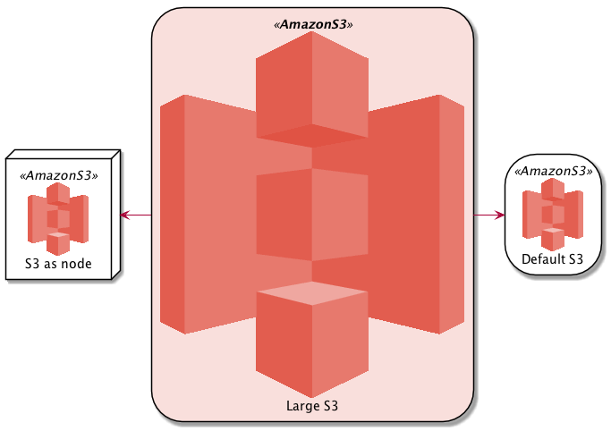
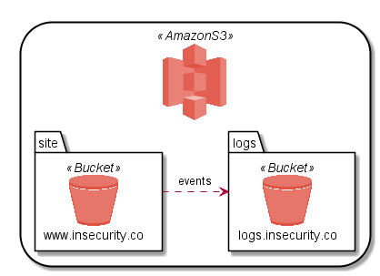
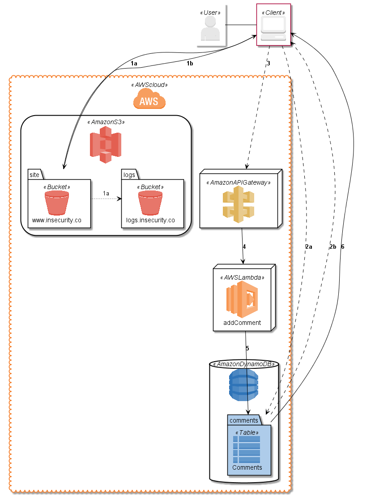

# AWS-PlantUML
PlantUML sprites, macros, stereotypes, and other goodies for creating PlantUML diagrams with AWS components.

AWS-PlantUML has high-quality sprites and convenient macros for AWS components and services for all of the AWS icons in the [AWS Simple Icons](https://aws.amazon.com/architecture/icons/) package, so that you can quickly and easily add stylized AWS elements to your PlantUML deployment diagrams.

## Getting Started
At the top of your PlantUML `.puml` file, first include the the `common.puml` file found in the `dist` folder at the root of this repo.

If you want to tweak the basic representation of AWS-PlantUML entities, or you don't want to rely on an internet connection, you can just download `common.puml` to your local machine and add it after the `@startuml` with:

    !include path/to/common.puml

Otherwise, you can link directly to the file in this repo with:

    !includeurl https://raw.githubusercontent.com/milo-minderbinder/AWS-PlantUML/release/17-1-19/dist/common.puml

After the `common.puml` is added, you can then add any additional `.puml` files from AWS-PlantUML to import the specific sprites, macros, and other definitions you need. Sometimes it's helpful to define a constant pointing to the `dist` folder of the AWS PlantUML version you're using, to make switching versions and hosts easier.

    !define AWSPUML https://raw.githubusercontent.com/milo-minderbinder/AWS-PlantUML/release/17-1-19/dist
    !includeurl AWSPUML/common.puml
    !includeurl AWSPUML/Storage/AmazonS3/AmazonS3.puml
    !includeurl AWSPUML/Storage-Content-Delivery/AmazonS3/bucket/bucket.puml

Macro definitions for components, like S3 and S3 Buckets, will take an alias as the first parameter, and a label as an optional second parameter:

    AMAZONS3(s3_internal)
    AMAZONS3(s3_partner,"Vendor's S3")
    s3_internal <-- s3_partner

Starting from version 17.1.6, all icons now have a large version of sprites with accompanying macros and stereotypes. For additional customization, there is now a new six-parameter macro for all icons, which adds four new optional parameters in addition to the `alias` and `label` parameters, so that users can set the entity type, sprite color, stereotype, and sprite, respectively:

    ...<SNIP>...
    !includeurl AWSPUML/Storage/AmazonS3/AmazonS3_LARGE.puml

    skinparam nodeBackgroundColor White
    skinparam storage<<**AmazonS3**>> {
        backgroundColor #F9DFDC
    }
    AMAZONS3(s3_internal,"Default S3")
    AMAZONS3(s3_internal2,"S3 as node",node)
    AMAZONS3_LARGE(s3_partner,"Large S3")

    s3_internal2 <-r- s3_partner
    s3_internal <-l- s3_partner

You can also nest components inside others using enclosures:

    AMAZONS3(s3) {
        BUCKET(site,www.insecurity.co)
        BUCKET(logs,logs.insecurity.co)
    }
    site .r.> logs : events

Before you know it, you'll be creating nice, clean diagrams for your AWS applications:

    @startuml
    !define AWSPUML https://raw.githubusercontent.com/milo-minderbinder/AWS-PlantUML/release/17-1-19/dist

    !includeurl AWSPUML/common.puml
    !includeurl AWSPUML/ApplicationServices/AmazonAPIGateway/AmazonAPIGateway.puml
    !includeurl AWSPUML/Compute/AWSLambda/AWSLambda.puml
    !includeurl AWSPUML/Database/AmazonDynamoDB/AmazonDynamoDB.puml
    !includeurl AWSPUML/Database/AmazonDynamoDB/table/table.puml
    !includeurl AWSPUML/General/AWScloud/AWScloud.puml
    !includeurl AWSPUML/General/client/client.puml
    !includeurl AWSPUML/General/user/user.puml
    !includeurl AWSPUML/Storage/AmazonS3/AmazonS3.puml
    !includeurl AWSPUML/Storage/AmazonS3/bucket/bucket.puml

    skinparam componentArrowColor Black
    skinparam componentBackgroundColor White
    skinparam nodeBackgroundColor White
    skinparam agentBackgroundColor White
    skinparam artifactBackgroundColor White

    USER(user)
    CLIENT(browser)

    AWSCLOUD(aws) {

        AMAZONS3(s3) {
            BUCKET(site,www.insecurity.co)
            BUCKET(logs,logs.insecurity.co)
        }

        AMAZONAPIGATEWAY(api)

        AWSLAMBDA(lambda,addComment)

        AMAZONDYNAMODB(dynamo) {
            TABLE(comments,Comments)
        }
    }

    user - browser

    browser -d-> site :**1a**
    site ~> logs :1a
    site -u-> browser :**1b**
    browser ..> comments :**2a**
    comments ..> browser :**2b**

    browser .r.> api :**3**

    api -d-> lambda :**4**

    lambda -> comments :**5**

    comments --> browser :**6**

    @enduml

## Customized Builds
For those so inclined, it is also simple to generate customized `.puml` files for your own personalized AWS-PlantUML diagrams with unique styles and colors. Building a custom version of AWS-PlantUML takes only three simple steps:

    1. Download the [AWS Simple Icons set](https://aws.amazon.com/architecture/icons/) and extract them into a directory well refer to as `<ICONS_DIR>`
    2. Configure and/or add styles to the `awspuml.ini` configuration file, or create your own
    3. Run the `awspuml.py` script against your downloaded `<ICONS_DIR>` using your custom config

#### 1. Download
If you haven't installed it already, you'll need Python 3 to run the `awspuml.py` module used to generate the AWS-PlantUML `.puml` files. You can get installation instructions and binaries for Python 3.6, which was used to generate the release version of AWS-PlantUML, on [Python.org](https://www.python.org/downloads/release/python-360/).

Download the AWS Simple Icon set [here](https://aws.amazon.com/architecture/icons/) and extract the contents to a directory we'll refer to as `<ICONS_DIR>`. This release was generated from version 17.1.19 of the AWS Simple Icons set release by Amazon.

#### 2. Configure
Using the release version of the `awspuml.ini` configuration file as a reference, you can specify custom styles for your own AWS-PlantUML build. The `[AWSPUML.colors]` section maps color names to simple HTML color names (e.g. Red) or custom hex values (e.g. #AAFFCC). These custom color names can then be referenced elsewhere in the configuration by including `${AWSPUML.colors:<COLOR_NAME>` in a configuration option value, where "`<COLOR_NAME>`" would be replaced by the desired option in the `[AWSPUML.colors]` section.

The remaining sections designate generation options for the folders created from the icons in `<ICONS_DIR>`. To make the generated folder structure of AWS-PlantUML URL-safe, the `awspuml.py` script relies on Amazon's file naming convention for the AWS Simple Icon set, which names files according to the pattern:

    <CATEGORY>_<SERVICE_NAME>[_<SERVICE_COMPONENT>][_LARGE].<FILE_EXTENSION>

Options in the `awspuml.ini` can be set for an entire category

    [InternetOfThings]
    entity_type: artifact

or for all subsections of a category

    [InternetOfThings.AWSIoT.]
    entity_type: component

or just for a specific item in a category

    [InternetOfThings.AWSIoT.action]
    entity_type: usecase

Valid options are:

    * `entity_type` - sets the PlantUML representation for the matching AWS-PlantUML components. Examples include `artifact`, `component`, `cloud`, etc.
    * `color` - sets the foreground color for the matched entity's sprite
    * `skinparam` - sets custom skinparam options for the stereotype generated for corresponding entities. An example value for this option would be `BackgroundColor Red`.

#### 3. Run
After configuring, simply run the `awspuml.py` module from the command line using Python 3, passing the configuration file and the `<ICONS_DIR>` as command line options. If you need help, just call the script with the `-h` flag to print usage help to stdout:

    > python3 awspuml.py -h
    usage: awspuml.py [-h] [-c CONFIG] [-g] [-o OUTPUT] icons_path

    Generate PlantUML Sprites from AWS Simple Icons

    positional arguments:
      icons_path            Path to AWS Simple Icons directory

    optional arguments:
      -h, --help            show this help message and exit
      -c CONFIG, --config CONFIG
                            Config file for puml generation (default:
                            /home/milo/AWS-PlantUML/awspuml.ini)
      -g, --generate_config
                            Write all sections to the INI file specified by the -c
                            switch; if an INI file already exists, its sections
                            and options will be preserved, but missing sections
                            will be added and invalid sections will be deleted.
                            (default: False)
      -o OUTPUT, --output OUTPUT
                            Output path for generated .puml files (default:
                            /home/milo/AWS-PlantUML/dist)

Enjoy!
