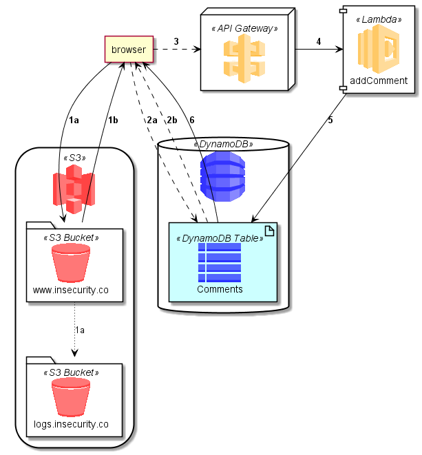

# AWS-PlantUML
PlantUML sprites, macros, stereotypes, and other goodies for creating PlantUML diagrams with AWS components.

At a minimum, you'll find that AWS-PlantUML will have a high-quality sprite for any of the AWS icons in the [AWS Simple Icons](https://aws.amazon.com/architecture/icons/) package.

In many cases, you'll find that convenience macros are defined for AWS components and services, to quickly add stylized elements to your PlantUML component diagrams.

## Getting Started
At the top of your PlantUML `.puml` file, first include the the `common.puml` file found in the root of this repo.

If you want to tweak the basic representation of AWS-PlantUML entities, or you don't want to rely on an internet connection, you can just download `common.puml` to your local machine and add it after the `@startuml` with:

    !include path/to/common.puml

Otherwise, you can link directly to the file in this repo with:

    !includeurl https://raw.githubusercontent.com/milo-minderbinder/AWS-PlantUML/master/common.puml

After the `common.puml` is added, you can then add any additional `.puml` files from AWS-PlantUML to import the specific sprites, macros, and other definitions you need.

    !includeurl https://raw.githubusercontent.com/milo-minderbinder/AWS-PlantUML/master/common.puml
    !includeurl https://raw.githubusercontent.com/milo-minderbinder/AWS-PlantUML/master/StorageContentDelivery/S3/StorageContentDelivery_AmazonS3_Bucket.puml
    !includeurl https://raw.githubusercontent.com/milo-minderbinder/AWS-PlantUML/master/StorageContentDelivery/S3/StorageContentDelivery_AmazonS3.puml

To add components with macro definitions, like S3 and S3 Buckets, typically these macros will take an alias as the first parameter, and a label as an optional second parameter:

    AWS_S3(s3_internal)
    AWS_S3(s3_partner,Vendor's S3)
    s3_internal <-- s3_partner

You can also nest components inside others using enclosures:

    AWS_S3(s3) {
        S3_BUCKET(site,www.insecurity.co)
        S3_BUCKET(logs,logs.insecurity.co)
    }
    site .r.> logs : events

Before you know it, you'll be creating nice, clean diagrams for your AWS applications:

    @startuml
    !define AWS_PLANTUML https://raw.githubusercontent.com/milo-minderbinder/AWS-PlantUML/master

    !includeurl AWS_PLANTUML/common.puml
    !includeurl AWS_PLANTUML/StorageContentDelivery/S3/StorageContentDelivery_AmazonS3_Bucket.puml
    !includeurl AWS_PLANTUML/StorageContentDelivery/S3/StorageContentDelivery_AmazonS3.puml
    !includeurl AWS_PLANTUML/Compute/Lambda/Compute_Lambda.puml
    !includeurl AWS_PLANTUML/Database/DynamoDB/Database_DynamoDB.puml
    !includeurl AWS_PLANTUML/Database/DynamoDB/Database_DynamoDB_Table.puml
    !includeurl AWS_PLANTUML/ApplicationServices/APIGateway/ApplicationServices_APIGateway.puml

    skinparam componentArrowColor Black

    agent browser

    AWS_S3(s3) {
        S3_BUCKET(site,www.insecurity.co)
        S3_BUCKET(logs,logs.insecurity.co)
    }

    API_GATEWAY(api)

    LAMBDA_FUNCTION(lambda,addComment)

    DYNAMODB(dynamo) {
        DYNAMODB_TABLE(comments,Comments)
    }

    browser --> site :**1a**
    site ~~> logs :1a
    site --> browser :**1b**
    browser ..> comments :**2a**
    comments ..> browser :**2b**

    browser .r.> api :**3**

    api -r-> lambda :**4**

    lambda --> comments :**5**

    comments --> browser :**6**
    @enduml

Enjoy!
